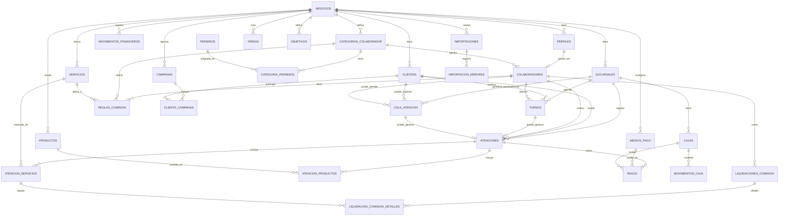
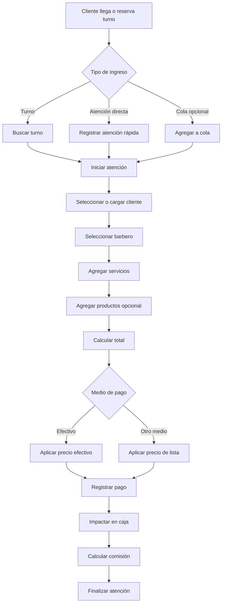

# Mi BarberiApp 💈

**Mi BarberiApp** es una PWA/SaaS en desarrollo para la gestión integral de barberías.  
El objetivo inicial es crear una demo gratuita para una barbería real, con foco en velocidad de uso, control financiero y crecimiento comercial. A futuro, el sistema podrá venderse a otras barberías como software de gestión.

---

## 🚀 Objetivo del proyecto

Crear una aplicación web para barberías que permita administrar:

- Clientes
- Turnos
- Atenciones rápidas
- Servicios
- Productos
- Cobros
- Medios de pago
- Cierres de caja
- Movimientos financieros
- Comisiones de barberos
- Reportes y gráficos
- Tareas y objetivos
- Fidelización de clientes
- Importación de datos desde CSV/Excel

La idea principal no es construir solamente una app de turnos, sino una herramienta de gestión diaria para propietarios de barberías en crecimiento.

---

## 🧠 Contexto del negocio

El sistema nace para una barbería que trabaja tanto con turnos como por orden de llegada.

El propietario es barbero maestro, administra el negocio y trabaja con colaboradores monotributistas a comisión. Su prioridad es tener control claro sobre caja, ingresos, egresos, comisiones, ventas, objetivos y crecimiento.

El sistema debe permitir una carga rápida de atenciones, evitando pasos innecesarios. Por eso, la cola de atención será opcional y no obligatoria.

---

## 🛠️ Stack tecnológico

- **React**
- **Vite**
- **Supabase**
- **Vercel**
- **PWA**
- **React Router**
- **React Icons**
- **PostgreSQL**
- **Mermaid para documentación técnica**

---

## 🎨 Diseño inicial

La app contará desde la base con un sistema visual propio:

- Tema claro
- Tema oscuro
- Switch visual con sol/luna
- Variables CSS globales
- Estilos reutilizables
- Diseño responsive
- Enfoque mobile-first

---

## 🧩 Módulos principales

```mermaid
flowchart TD
    A[Mi BarberiApp] --> B[Clientes]
    A --> C[Turnos]
    A --> D[Atenciones rápidas]
    A --> E[Servicios]
    A --> F[Productos]
    A --> G[Cobros]
    A --> H[Caja diaria]
    A --> I[Finanzas]
    A --> J[Comisiones]
    A --> K[Reportes]
    A --> L[Tareas y objetivos]
    A --> M[Fidelización]
    A --> N[Importaciones]
    A --> O[Roles y permisos]

    B --> B1[Alta rápida]
    B --> B2[Historial]
    B --> B3[Cumpleaños]
    B --> B4[Clientes inactivos]

    D --> D1[Cliente opcional]
    D --> D2[Servicios realizados]
    D --> D3[Productos vendidos]
    D --> D4[Cobro directo]

    G --> G1[Precio de lista]
    G --> G2[Precio efectivo]
    G --> G3[Medios de pago]
    G --> G4[Pagos mixtos]

    H --> H1[Apertura]
    H --> H2[Movimientos]
    H --> H3[Cierre]
    H --> H4[Diferencias]

    I --> I1[Ingresos]
    I --> I2[Egresos]
    I --> I3[Retiro propietario]
    I --> I4[Comparativas]

    J --> J1[Reglas por barbero]
    J --> J2[Reglas por categoría]
    J --> J3[Liquidaciones]
    J --> J4[Pagos]
```



---

## 🧱 Diagrama ER preliminar



---

## 💈 Flujo principal de atención



---

## 💰 Precio de lista y precio efectivo

Los servicios y productos manejarán dos precios:

| Campo | Descripción |
|---|---|
| `precio_lista` | Precio general o precio publicado |
| `precio_efectivo` | Precio preferencial para pago en efectivo |

Esto permite analizar:

- Diferencia entre precio publicado y precio cobrado
- Descuentos por medio de pago
- Rentabilidad por producto
- Ingresos por efectivo vs medios digitales
- Impacto de promociones o descuentos

---

## 👥 Roles iniciales

El sistema contempla categorías editables por el propietario.

Roles sugeridos:

- Propietario
- Barbero Junior
- Barbero Full
- Barbero Senior
- Encargado
- Aprendiz
- Administrativo

Cada categoría podrá tener permisos personalizados.

---

## 📊 Reportes previstos

Algunos reportes clave del sistema:

- Ingresos vs egresos
- Caja diaria
- Diferencias de caja
- Facturación por barbero
- Servicios más vendidos
- Productos más vendidos
- Ticket promedio
- Comisiones pendientes
- Comisiones pagadas
- Clientes nuevos
- Clientes recurrentes
- Clientes inactivos
- Cumpleaños del mes
- Medios de pago más utilizados

---

## 📦 Estado actual

Proyecto en etapa inicial.

### Próximos pasos

- Crear estructura base del proyecto
- Configurar estilos globales
- Implementar tema claro/oscuro
- Configurar rutas
- Preparar conexión con Supabase
- Configurar autenticación con Google
- Crear modelo inicial de base de datos
- Preparar ABM de clientes, servicios y productos

---

## 📁 Estructura prevista

```txt
src/
├─ assets/
├─ components/
│  ├─ layout/
│  ├─ theme/
│  └─ ui/
├─ config/
├─ features/
│  ├─ auth/
│  ├─ clientes/
│  ├─ servicios/
│  ├─ productos/
│  ├─ turnos/
│  ├─ atenciones/
│  ├─ caja/
│  ├─ finanzas/
│  ├─ comisiones/
│  ├─ reportes/
│  └─ configuracion/
├─ hooks/
├─ lib/
├─ routes/
├─ styles/
│  ├─ variables.css
│  ├─ themes.css
│  ├─ base.css
│  ├─ layout.css
│  ├─ utilities.css
│  └─ index.css
├─ App.jsx
└─ main.jsx
```

---

## ⚠️ Licencia y uso

Este proyecto se encuentra en desarrollo privado/comercial.

No se concede permiso de uso, copia, modificación, distribución ni explotación comercial sin autorización expresa del autor.

El código puede estar visible públicamente durante la etapa de desarrollo, pero eso no implica que sea software libre ni open source.

---

## Copyright

Copyright © 2026 Aníbal Daniel Cabeza.  
Todos los derechos reservados.

---

## Autor

Proyecto desarrollado por **Aníbal Daniel Cabeza** como solución SaaS/PWA para gestión de barberías.